# Virtual Labs

>A project that helps students to simulate their practicals on the app, build on Flutter.

This app is developed for students so that they can simulate their experiments online, giving them freedom to experiment with their curriculum.

The web version can be seen on: https://github.com/mehtaAnsh/VirtualLabs-React#build-setup

## Getting Started

This project is a starting point for a Flutter application.

A few resources to get you started if this is your first Flutter project:

- [Lab: Write your first Flutter app](https://flutter.dev/docs/get-started/codelab)
- [Cookbook: Useful Flutter samples](https://flutter.dev/docs/cookbook)

For help getting started with Flutter, view our
[online documentation](https://flutter.dev/docs), which offers tutorials,
samples, guidance on mobile development, and a full API reference.

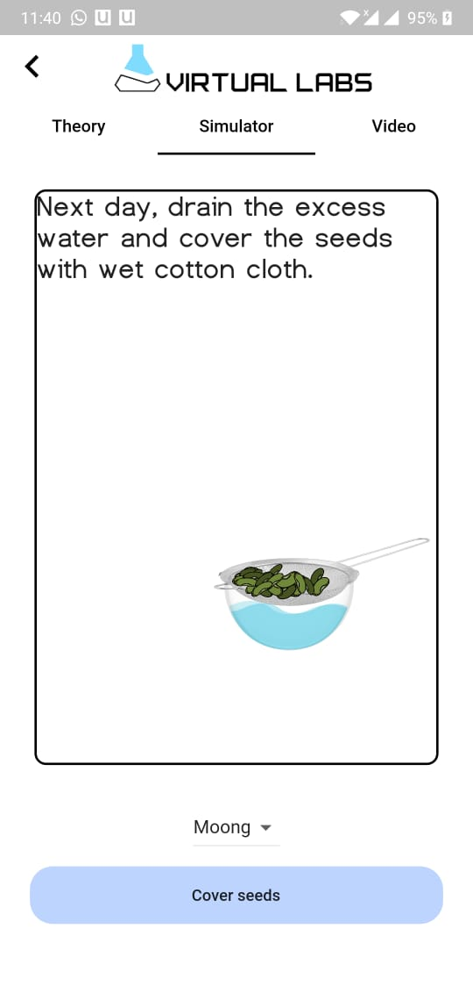
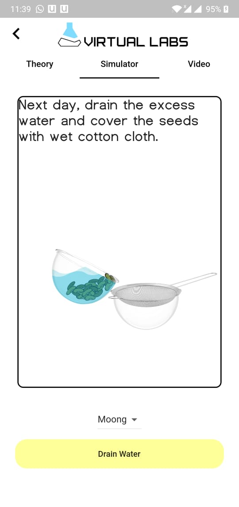
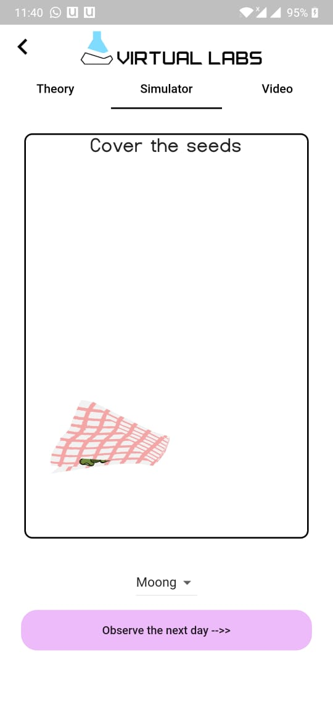
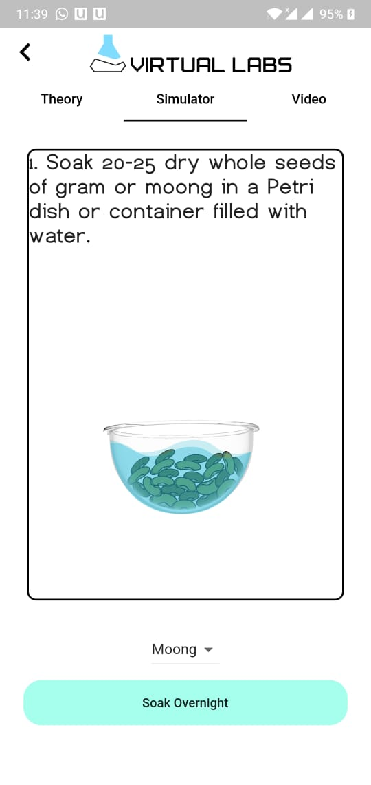
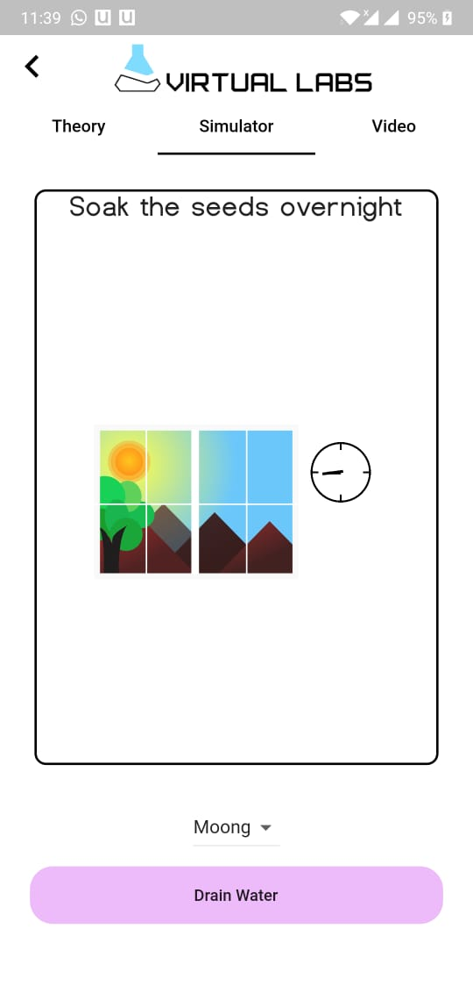
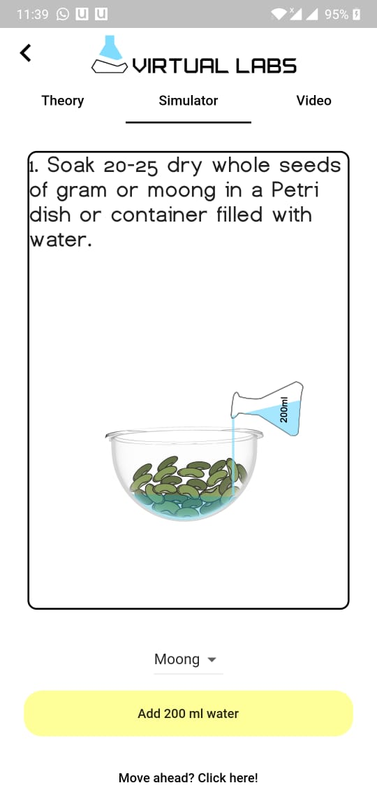
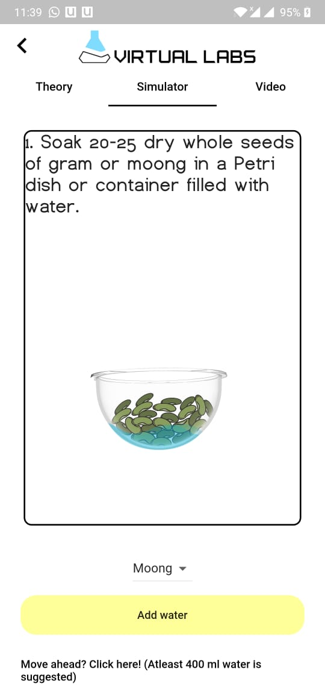
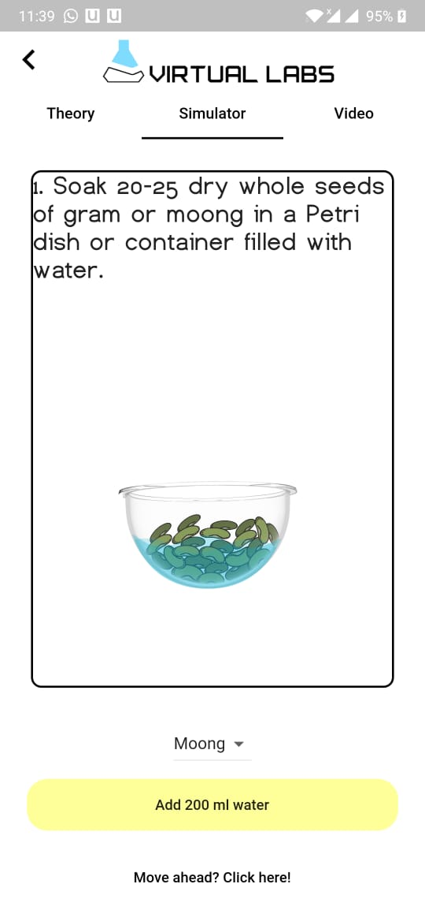
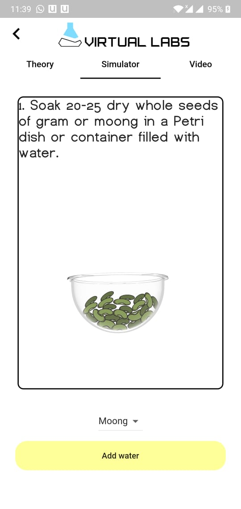
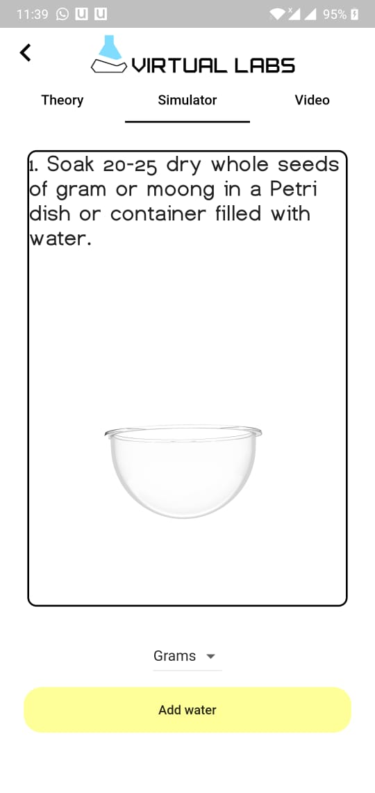
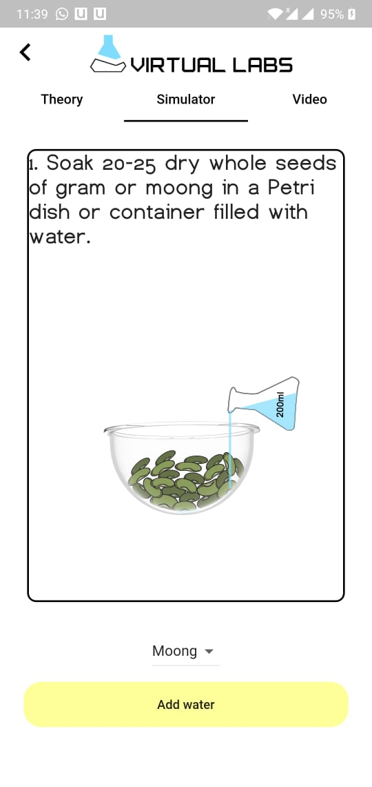
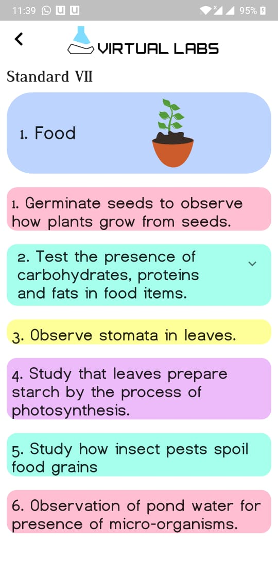
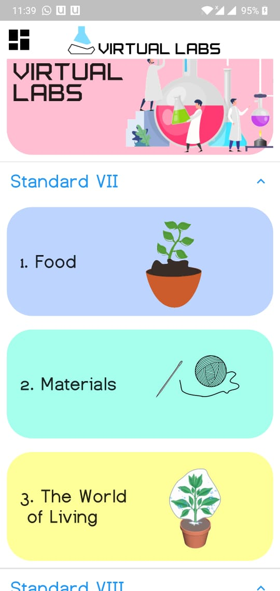
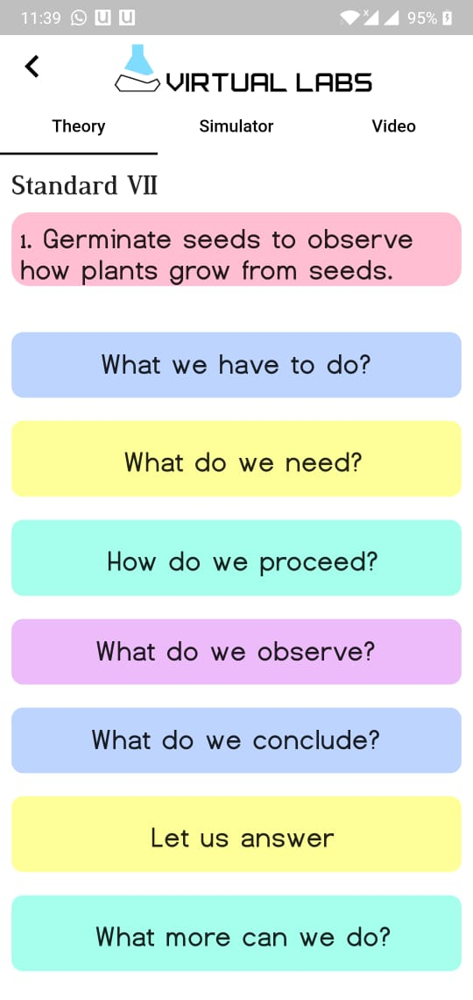
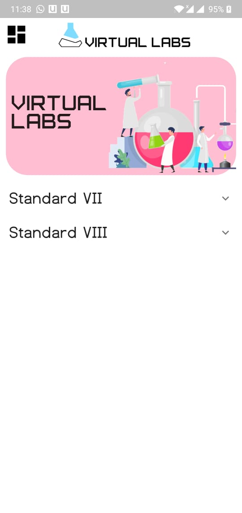
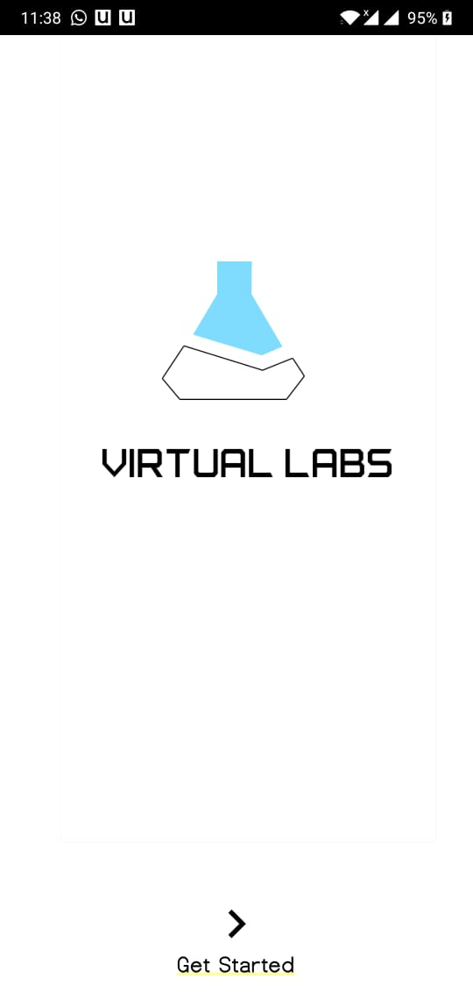
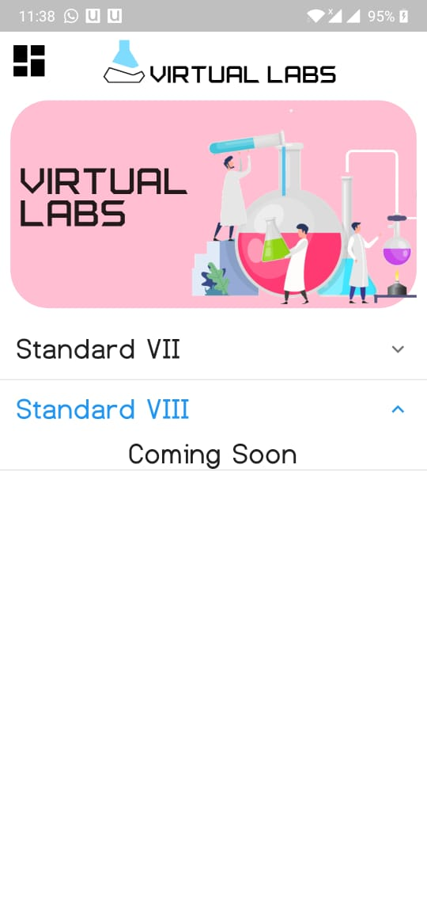
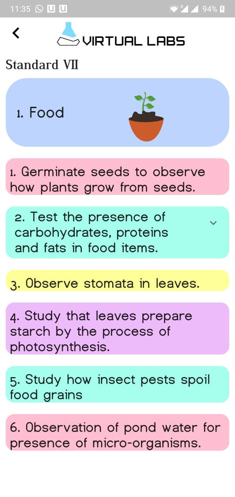

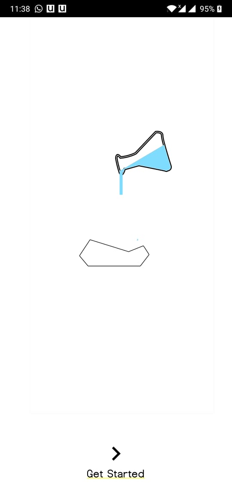
